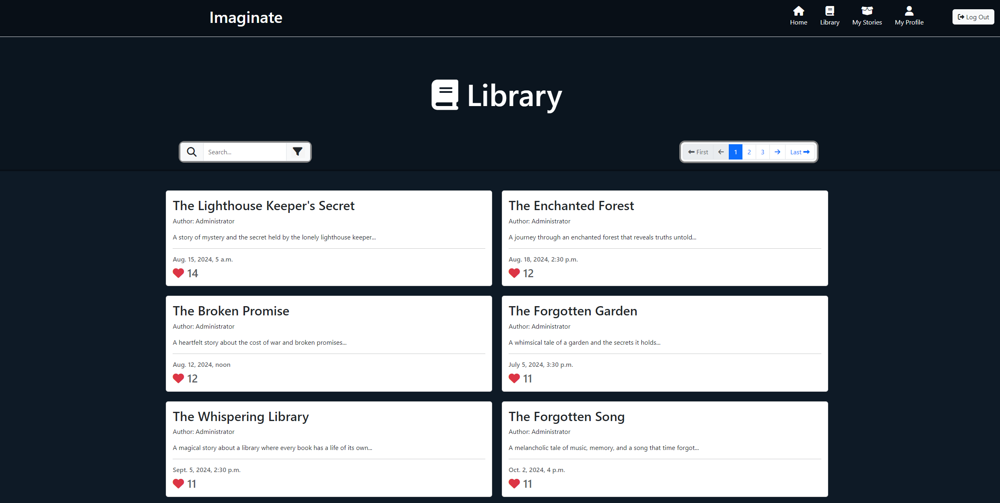
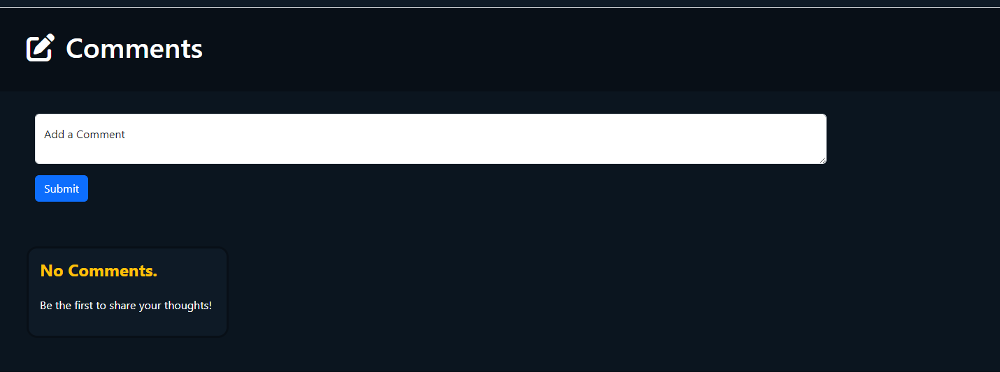

# Imaginate.

[Imaginate](https://imaginate-project4-marcusf-ce5676c7b6a0.herokuapp.com). Stories for readers, fueled by the power of imagination.  With a modern user-driven design, Imaginate aims to be the new core place to write, store and share a individuals imagination online.


---

# Table of Contents

1. [UX](#ux)

   - [Goals](#goals)
     - [Visitor Goals](#visitor-goals)
     - [Business Goals](#business-goals)
     - [User Stories](#user-stories)
   - [Visual Design](#visual-design)
     - [Fonts](#fonts)
     - [Icons](#icons)
     - [Colors](#colors)

2. [Features](#features)

    - [Page Elements](#page-elements)
      - [All Web Pages](#all-web-pages)
      - [Header & Navigation](#header--navigational-bar)
      - [Footer](#footer)
      - [Home Page](#home-page)
      - [Index / Library Page](#index-page--library-page)
      - [Story Page](#story-page)
      - [User Profile](#user-profile-page)
      - [My Stories](#my-stories-page)
      - [Story Creator](#story-creator-page)
    - [Additional Site Features](#additional-site-features)
      - [Admin Panel](#admin-panel)
      - [Coming Soon Modal](#coming-soon-modal)
    - [Database Schema](#database-schema)
      - [Story Model](#story-model)
      - [Comment Model](#comment-model)
      - [UserProfile Model](#userprofile-model)
      - [Newsletter Model](#newsletter-signup-model)

3. [Technology Used](#technology-used)

   - [Languages](#languages)
   - [Frameworks](#frameworks)
   - [Databases](#databases)
   - [Libraries](#libraries)
   - [Platforms](#platforms)
   - [Other Tools](#other-tools)

4. [Testing](#testing)

   - [Methods](#methods)
     - [Validation](#validation)
     - [General Testing](#general-testing)
   - [Bugs](#bugs)
     - [Known Bugs](#known-bugs)
     - [Fixed Bugs](#fixed-bugs)

5. [Deployment](#deployment)

    - [Github Deployment](#github-deployment)
        - [Github Preperation](#github-preparation)
        - [Github Instructions](#github-instructions)
    - [Heroku Deployment](#heroku-deployment)
        - [Heroku Preperation](#heroku-preparation)
        - [Heroku Instructions](#heroku-instructions)


6. [Credits and Contact](#credits-and-contact)

    - [Credits](#credits)
    - [Contact](#contact)

---

# UX

## Goals

### Visitor Goals

The target audience for Imaginate are:

- Users who like to write stories.
- Users that want a easy to navigate, modern and user friendly story site. 
- Users that want a place to share their stories online.
- Users who want to read stories and give feedback.
- Users that want to be part of a community.

The user goals are:

- To register an account with the site.
- To login to their account on the site. 
- To post their stories online.
- To have the ability to private their stories.
- To have the ability to visit other's profile page.
- To build a portfolio of their stories on their profile page.
- To have the power to delete their story.
- To have the ability to access other public stories.
- To react to the story with a up vote.
- To comment on a users story.
- To edit and delete their comments.

Imaginate fills these goals by:

- Providing a way to Create & Login to a site account.
- Providing a story creation page to write a story.
- Providing a story private button to toggle public/private on owned stories.
- Providing a User Profile page for every user. With the ability to delete all stories, all comments and account.
- Providing a link to users profile page via author names on stories & comments.
- Providing a Library page containing a list of public stories that can be filtered & searched.
- Providing a Comment section under every story to comment.
- Providing buttons to delete and edit comments belonging to the logged in user.
- Providing upvote button on story page to upvote a story.
- Providing a My Stories page to show a list of logged in user's stories.

### Business Goals

The Business Goals for Imaginate are:

- Obtain a userbase of individuals who like to read & write stories.
- Maintain a free and limitless platform for all users.
- Become a community recognised name in the online writer & reader society.

### User Stories

1. As a returning reader I want to be able to create an account on the site so I can always view new stories.
2. As a writer I want to be easily able to locate all my stories all in one place.
3. As a clumsey writer I really need to be able to edit and even delete my stories in case I make a mistake.
4. As a community driven person I would love there to be a way I can comment on & upvote stories so I can be part of the community.
5. As a writer I would feel safe if I could private my work.

More user Stories can be found [here](https://github.com/users/MarcusFDev/projects/4/views/1).

## Visual Design

### Fonts


- For the Imaginate site no added fonts were used. Only Bootstrap's default font styling is allowed to take effect. This is due to prefering a simple contemporary approach to the font. It is easy to ready and suits the site well in style. 

### Icons


- Icons used throughout the website were taken from the [Font Awesome](https://fontawesome.com) icon library. They were utilized in the `<i>` tag.
- Icons are used in the navigational Bar & Footer as well as in other assets and pages on the site such as the bootstrap modal. They were used to create a more visually appealing site. Appropriate use of icons was done to also visually help users navigate the webpages.

### Colors


- When designing Imaginate I went through a brief concept stage in pre-development. Intially the first project's styling took place on the user profile where the first iteration of finalized structure and colors were used. At the time Bootstrap v5.3's `Text-White` and `Text-Dark` colors were being used however as a developer I was accidentally inspired by GitHub's own color schema. I enjoyed the deep navy blue darker tones and felt it was something that would suit Imaginate's purpose.

With the text-content being the bright 'light source' on the page, it tricks the brain into focussing on it more hence focussing on the content that matters most, the story. While it is not the final design I had intended for the deadline I think it is close to setting the right theme.

- Equally when picking out color tones I felt the dark navys represent the concept of 'nothing' or 'empty' on their own which is intended to invoke imagination to fill in that blank space. Which if succeeded, furfils one of the site's primary objectives, to encourage imagination.

- The Color Tone `#0E1A26` is the lightest of the 3 tones and is the primary color used on Imaginate. It is not too dark but not too bright and is perfect to be the primary color especially as the other darker tones act to highlight it even more.

- Tone `#0B151F` is the secondary color tone of the site. It is used more sparingly to help divide up the page. Seen first used on the Home Page social & newsletter sections.

- The Third tone is `#080F17` and is the third main color in the palette trio. It is used for the Header & Footer and other borders meant to highlight the other colors without overuse.

- Bootstrap's `text-white` & `text-warning` classes are used for the text colors to contrast with the darker background.

---
# Features

## Page Elements

### All Web Pages

### Header & Navigational Bar


- The header & Navigational bar is located on all pages of the website however it's content and purpose differs on the Home Page. Using `#080F17` and the `text-white` for the text color.
- The 'Imaginate' title itself is a button to the home page when clicked.
- The Header is response to screen sizes.
- The Icons have seperate custom animations on hovering over each element.
- The Header content changes on the Home Page with new buttons depending on user login status.
- It is placed in the `base.html` file and used as a template to other html files to prevent code duplication and promote better code handling.

### Footer


- The Footer is located on all pages of the website.
- It contains a copyright message & the site socials on all screens except homepage. Utilizing the font awesome icons to represent the different socials.
- Each Social button sends users to a new tab.
- On the Homepage the footer does not contain site social buttons as a social section exists instead.

### Home Page


- The Home page, stored in the `accounts/templates/home/home_page.html` is the landing page of the site. It was not given the standard index.html file as it was decided to focus a content first approach.
- It contains slightly different Header styling & Footer styling.
- Alerts for some suer interactions including logging out and account deletion.
- Place where users create a site account & login. Buttons change depending on login status.
- Responsive to all devices.
- Register
    - Register button on the page calls a Bootstrap modal containing a signup form.
    - Style changes indicating of errors along side showing error messages.
    

    - Register functionality in `accounts/views.py | line 14` & `accounts/forms.py | line 8`

- Login
    - Login button on the page calls a Bootstrap modal containing a login form.
    - Style changes indicating of erros along side showing error messages.
    

    - Login functionality in `accounts/views.py | line 51` & `accounts/forms.py | line 143`


- Newsletter
    - Newsletter is found on this page. Allows users to input a email address to sign up to a future newsletter implemntation with EmailJS.
    - Utilizing a custom model in `accounts/models.py`.
    

    - Newsletter functionality is attached to the homepage view itself at `accounts/views.py | line 232` & `accounts/forms.py | line 230`

### Index Page / Library Page



- The Index page or what is semantically known as the Library page, is the second main page of the site and contains the the list of stories on the site for users to read.
- It is stored in the `stories/templates/index.html` in the stories app directory.
- Uses Django templating & condition statements to generate the story list dynamically eliminating the need of manual html code for each story entry.
- Each story entry has important information shared with a link to each story by clicking the story name.
- Paginator at the top & bottom of the file when there is mor ethan one pages worth of stories.
- Responsive to all devices.
- Search bar & filter
    - Allows users to input search querys and looks for matching stories in the list.
    - Works along side a filter that has 4 pre-determined filtering options.
    

    - Search bar functionality in `stories/views.py | line 13`

### Story Page


- The Story page, located as the `stories/templates/story_page.html`, is the story page for the site.
- Story pages are dynamically made using the `<slug>` in the story model.
- Content on the page is dynamically generated using Django templating and condition statements.
- It provided users with a upvote button to upvote the story that dysnamically updates using JQuery.
- Story author names can be clicked on which sends readers to the author's profile page.
- Responsive to all devices.
- Story functionality in `stories/views.py | line 92`
- Comments
    - Users can write a comment on a page.
    - On comments that are owned by the logged in user edit & delete buttons are visible.
    - Comments can be edited & deleted dynamically.
    - Contains user interaction alerts using JQuery.
    - Comments can be upvoted dysnamically also.
    - Comment Author names can be clicked on to go to their profile page.
    

    - Story Comments functionality in `stories/views.py | line 290, 320, 349, 395` & `stories/forms.py | line 6`

### User Profile page


- The User Profile page, providing users with their own personal hub to control certaina ccount features.
- Located in the `accounts/templates/users/user_profile.html` in the accounts app.
- Every User profile is unique allowing others to go to other account profiles. If users go to other accounts profiles settings and edit buttons are hidden.
- Has a Settings section containing Delete All Stories, Delete All Comments & Delete Account.
- About Bio
    - When edit is clicked the `aboutme_modal.html` is triggered.
    - Uses Summernote text editor to input new bio data.
    - About Bio functionality in `accounts/views.py | line 168` & `accounts/forms.py | line 195`
- Delete All Comments
    - Button available to purge all comments belonging to the logged in user off the site.
    - Delete All Comments functionality in `stories/views.py | line 447`
- Delete All Stories
    - Button available to purge all stories belonging to the logged in user off the site.
    - Delete All Stories functionality in `stories/views.py | line 424`
- Delete Account
    - Button to delete account on the Imaginate site which purges all associated content off the site.
    - Delete Account functionality in `account/view.py | line 213`

### My Stories page


- The My Stories page is a list of stories belonging to the logged in user.
- Located here `stories/templates/my_stories.html` in the stories app.
- Contains the Create Story button to write new stories.
- Has two buttons on every story entry, one to delete the story entry & one to private the story entry making it only accessible on that page.

- My Stories page functionality in `stories/views.py | line 52`

### Story Creator page


- The story creator allows users to create stories.
- Located in the `stories/templates/story_creator.html`.
- Has a private button to toggle privacy of the story when submitted.
- Contains a Story Form for a Story Title, a Excerpt & the Story content.

## Additional Site Features

### Admin Panel

The Imaginate Admin panel is a Django feature along the site to have a superuser interface. It has been altered using `accounts/admin.py` & `stories/admin.py` files giving admins a easier time handling site related tasks. 

### Coming Soon Modal

- Coming Soon bootstrap modal located `site-modals/coming_soon.html`.
- Used for the Policy button on Home Page to inform users the feature is not yet implemented.


## Database Schema

### Story Model

The Story Model creates a table in the database to handle story data. As Imaginate is a content first, Story Site having a robust Story model is important to collect data to be used in future functions & features. While not every piece of data is used, data like status will be used later to allow story drafts to be saved and handled by the user.

Story Model is found in `stories/model.py | line 9`.


### Comment Model

The Comment Model creates a table in the database to handle comment data. user interaction is important to build a community and having available feedback on stories Imaginate needed. The comment model is associated with a story instance. Likewise with the Comment model not all data collected is being used but it was designed with future development in mind.

Comment Model is found in `stories/models.py | line 35`.


### UserProfile Model

The UserProfile Model creates a table in the database to handle user profile specific data. This data includes the User bio and User Avatar, that currently is not a feature in the project due to time constraints.

UserProfile model is found in `accounts/models.py | line 6`


### Newsletter Signup Model

The Newsletter SignUp model creates a table in the database to handle newsletter subscriptions. Currently this data is being collected but not used as a EmailJS is not yet set up within the project.
It collects the user inputed data of a valid email address allowing it to be entered only once.

NewsletterSignup model is found in `accounts/models.py | line 22`


## Fixtures

Imaginate is a story focussed on writing & reading stories. It was important to ensure that the full showcase of the sites features could be visualized so story data was required to fill the `Story(models.Model):` database table. For the sake of showcasing functionality & maintaining time management for the project scope; a story fixture was used to append data to the database. [ChatGPT](https://chatgpt.com) was utilized with my fixture structure to generate story data quickly so that the database could be filled faster than manual story creation, for the sake of not wasting development time manually & individually adding every story entry.

A new directory called `stories/fixtures/` was added in the IDE with a `stories.json` file inside containing the database content. The command `Python3 manage.py loaddata stories` was run in the IDE terminal to append the data to the database.

Fixture file used can be found here: [Story Fixture](https://mystb.in/bc5539c9ffa90a5d99).


## Feature Ideas

Due to time constraints and the adapting scope of the project's first iteration deadline, the following feature ideas were not realized in this version. They are intended to released in the future during a new project development cycle.

### Project Content

- Edit Stories. provide a button to edit stories on the site and change story specific settings.
- Story List visiting. Ability to access other User's story list.
- Profile Avatar changing. Ability for users to change Avatars. (Given both premade selectable Avatars & the availability to upload their own.)
- News Feed that site Admins/Moderators can post update blogs.
- Homepage story showcase. Weekly changing highlight reel of most recent upvoted stories to encourage continuous strive for improvement in their works and appreciation for using the site. Alongside giving light to must-reads!
- Story tags. Allow writers to use predefined tags to help categorize their stories and readers the ability to filter tags to find story genres.
- Policy Page. A list of site policies informing users to follow so enforcement action can be handled.
- Story Drafts. Allow stories to be saved as drafts before publishing.
- Follow User Accounts. Ability to follow other user accounts & recieve notications.

And so much more before site can reach a Public Release date.

### Project Design

- More Dynamic page scroll animations. Such as a open book underneath the Home Page titles.
- Story/Library lists designed as a bookcase with each story being deisgned to represent a book.
- Story pages themselves styled with the content looking like a open book.

---

# Technology Used

## Languages

- [Python](https://docs.python.org/3/)
    - Complete Project Functionality.
- [JavaScript](https://developer.mozilla.org/en-US/docs/Web/JavaScript)
    - Adds interactivity and make dynamic web content.
- [HTML5](https://developer.mozilla.org/en-US/docs/Web/HTML)
    - Structure and layout of web pages.
- [CSS](https://developer.mozilla.org/en-US/docs/Web/CSS)
    - Styling for web pages.

## Frameworks

- [Django](https://www.djangoproject.com/)
    - A high-level Python web framework that encourages rapid development and clean, pragmatic design. It was crucial for building the web application's backend, handling routing, database interactions, and user authentication.

## Databases

For the project's submission Code Institute provided a Postgres database to store the data with. 

- [PostgreSQL](https://www.postgresql.org/)
    - An advanced, open-source relational database system known for its reliability, feature robustness, and performance. Used as the database for storing application data.

## Libraries

- [Bootstrap V5.3](https://getbootstrap.com/docs/5.3/getting-started/introduction/)
    - Widely used CSS library. Used throughout project to aid in page styling and limit the requirement of a lot of custom css & script code. 
- [JQuery V3.6](https://jquery.com)
    - Commonly used as a alternative and often more efficent than vanilla JavaScript functionality.
- [Re](https://docs.python.org/3/library/re.html)
    - Used with `clean()` in the `accounts/forms.py` file to handle special characters within account Registration & Login functionalities.
- [Summernote](https://summernote.org/)
    - A simple WYSIWYG editor that enables users to easily format text within the project, used for the profile description & story creation.
- [Gunicorn](https://gunicorn.org/)
    - A Python WSGI HTTP server for UNIX that serves the Django application in production, ensuring efficient handling of incoming requests.
- [WhiteNoise](http://whitenoise.evans.io/en/stable/)
    - A package that allows Django application to serve its own static files eliminating the need for a separate static file server.
- [Pillow](https://python-pillow.org/)
    - A Python Imaging Library that adds image processing capabilities to the application, allowing for tasks such as saving image files.

## Platforms

- [Github](https://github.com/MarcusFDev/imaginate-project4)
    - Storing code remotely.
- [Gitpod](https://www.gitpod.io)
    - IDE for project creation and development.
- [Heroku](https://dashboard.heroku.com/apps)
    - Used for project deployment and examination purposes.

## Other Tools

- [CI Python Linter](https://pep8ci.herokuapp.com)
    - Code Institute Python linter was used to validate the Python code.
- [Coolers](https://coolors.co)
    - Tool to create palette image of color schema.
- [Am I Responsive?](https://ui.dev/amiresponsive)
    - Tool used to create multiple device image.
- [FreeConvert](https://www.freeconvert.com)
    - Tool used to change images to .webp file types.
- [W3C HTML5 Validator](https://validator.w3.org/nu/#textarea)
    - Tool to validate HTML5 files meet website standards.
- [W3C CSS Validator](https://jigsaw.w3.org/css-validator/#validate_by_input)
    - Tool to validate CSS files to meet website standards.
- [ChatGPT](https://chatgpt.com)
    - AI Text Generator to automatically create unique fixture story entries.

# Testing

## Methods

### Validation

- HTML pages all have been validated with the [W3C HTML5 Validator](https://validator.w3.org/nu/#textarea) tool. Errors that do appear from the validator have been caused by Django templating. 


- All CSS code has been validated with the [W3C CSS Validator](https://jigsaw.w3.org/css-validator/#validate_by_input) tool.


- All Python code has been validated with the [CI Python Linter](https://pep8ci.herokuapp.com) tool. Below are the core functionality Python files validated. All others have been validated and resulted in zero errors.

`accounts/view.py` Validation:


`accounts/forms.py` Validation:


`stories/view.py` Validation:


`stories/forms.py` Validation:


- Accessibility has been tested using developer tools utilizing lighthouse.

Mobile Lighthouse Result using Google Chrome (Average Result)


Desktop Lighthouse Result Google Chrome (Average Result)


### General Testing

- After every iteration of code, everything was promptly manually tested to check for unexpected errors.
- Account Register & Login error handling works. (Bootstrap Modals close on page refresh however.)
- Newsletter signup correctly stores data to the database model for use.
- All links correctly work on all devices.
- Data correctly updates to all database model tables.
- Alerts implemented work correctly.
- Pages dynamically update with changes using JQuery and Ajax as intended.
- Story upvoting, deleting & creating work as intended.
- Comment upvoting, editing, deleting and creating work as intended.

## Bugs

### Known Bugs

- Story Upvote `<div>` not updating style upon AJAX button click. Page Refresh still required for styles to take effect.
- Account Login & Register modals close & page refresh upon failed form submission.
- If error in form is detected from either Login or Register, error styling is applied to other Modal, Register or Login respectively.
- Edited to empty About description does not append default empty message on profile page.
- Pages occasionally load slower than normal on higher latency due to amount of event listeners on each page load.
- Error messages handled poorly & inconsistently from form errors causing some to not correctly appear.


### Fixed Bugs

- (TEMPORARY FIX): Logout modal not correctly working in seperate modal.html file. Moved directly into `base.html` for functionality.
- Fix: Multiple formatting errors regarding `<div>` elements inside other elements incorrectly such as `<h1>, <span> & <ul>` elements.
- Fix: A error occured over a model change in the UserProfile model. Entire database was wiped clean with renewed model structure.
- Fix: LoginForm not working as intended, required large changes structurally. Commit message located [here](https://github.com/MarcusFDev/imaginate-project4/commit/0aab44fdc87818fc155355e9a36254e891a4d008)
 

# Deployment

[Imaginate](https://imaginate-project4-marcusf-ce5676c7b6a0.herokuapp.com) is a both frontend & backend project utilizing the Django framework to build a expandable and modern user-driven website. 

To experience the project [Heroku](https://dashboard.heroku.com/apps) was used to host Imaginate via their website platform. 

A Code Institute [template](https://github.com/Code-Institute-Org/ci-full-template) was used as the building block to bring Imaginate to life.

To view my Heroku deployment of Imaginate please follow this [link](https://imaginate-project4-marcusf-ce5676c7b6a0.herokuapp.com).

## Github Deployment

### Github Preparation

Requirements:

- You need a GitHub account.
- You need a IDE such as [GitPod](https://gitpod.io).

### Github Instructions

- Log in to your Github account and naviagte to this link in the project's repository: https://github.com/MarcusFDev/imaginate-project4
- You can choose to create your own repository and copy or fork & clone the project repository code.

### Forking
    
- In the top-right corner of the repository page, click the "Fork" button. This will create a copy of the repository under your GitHub account.

### Cloning

- After forking the repository navigate to the repository on your account found using the 'Your Repositories' button in the top-right dropdown menu.
- Click on the "Code" button and copy the repository's URL.
- Create a new workspace with the copied URL & load the workspace.

1. Inside your IDE enviroment, run the commands `npm install` in the terminal.
    - Followed by `pip install -r requirements.txt`. This will install all the dependancies you need to run Imaginate.
2. Create a `env.py` file in the project directory.
    - Paste this code into the file:
    
    ```
    import os

    os.environ.setdefault(
        "DATABASE_URL", "Insert-Database-Here"
    )

    os.environ.setdefault(
        "SECRET_KEY", "Insert-Key-Here"
    )
    ```

    - You must create a secret key for the project & paste in your database link (These are sensitive information and should always remain private). Configurations may apply in `settings.py` seek the [Django documentation](https://www.djangoproject.com/) for further guidance.

3. In `settings.py` add your IDE development workspace link to both CSRF_TRUSTED_ORIGINS & ALLOWED_HOSTS.
    - If any technical difficulties arise or you are unsure how to proceed refer to [Django documentation](https://www.djangoproject.com/) or online tutorials.

4. In the terminal create a superuser admin account in the database by running the command `python3 manage.py createsuperuser` and following the instructions in the terminal.

5. When ready load your development enviroment server with `python3 manage.py runserver`. Please note before pushing changes to your repository, do not forget to turn `DEBUG = False` in `settings.py` to prevent sensitive information being leaked.

## Heroku Deployment

### Heroku Preparation

Requirements: 

- You need a Heroku account.
- Followed previous set of instructions correctly.

### Heroku Instructions

1. Navigate to your Heroku dashboard and create a new app with a unique name.
2. When created, click on the app's settings button and reveal Config Vars (This is sensitive information and should always remain private).
3. Add a new key of `DATABASE_URL` and the value should be the link to your database. Similarly add another new key of `SECRET_KEY` and add the value of your secret key you chose. (Reccomended to be secure and very hard to guess)
    - These values should be identical to those added in the `env.py` file.
4. Now navigate to the Deploy section in your Heroku app & connect to your GitHub account. This should be the same one you used for the project repository.
5. Scroll down to the bottom of the page and click the 'Deploy Branch' to start a manual deployment of the main branch.
6. After a successful deployment, click the 'Open App' button to view your site hosted on Heroku.
    - If any technical difficulties arise during the deployment view the activity feed and troubleshoot the cause. Seek help from online forums & ellow developers for extra help if needed.


## Credits and Contact

### Credits

IDE Template:

- This Code Institute [template](https://github.com/Code-Institute-Org/ci-full-template) was used to set up the IDE environment for the Imaginate project.

### Contact

Please feel free to reach out if you have any questions. Contact me via my email at marcusf.dev@gmail.com